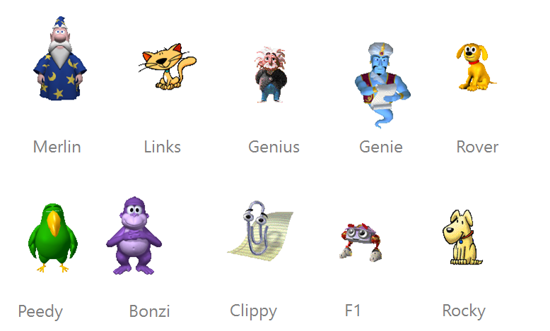

# Clippy
Add Clippy or his friends to your Mendix App for instant nostalgia. [DEMO](https://clippytestproject-sandbox.mxapps.io/)

Cippy for Mendix is born out a Mansystems R&D hackathon.
Thank you Derryn for your inspiration.

## Usage
1. Open the test project
1. Export `Clippy` module
1. Import module in your project
1. Place the `Clippy` widget on your layout or page
1. Select the preferred agent, by default `Clippy`
1. Create a Nanoflows with the animation actions

### Contribution
Big thanks t0 https://github.com/pi0/clippyjs
